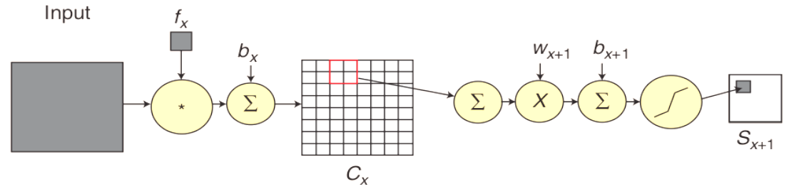

# Convolution Neural Network
Convolutional networks (LeCun, 1989), also known as convolutional neural networks or CNNs, are a specialized kind of neural network for processing data that has a known, grid-like topology. 

Deep neural networks exploit the property that many natural signals are compositional hierarchies, in which higher-level features are obtained by composing lower-level ones. In images, local combinations of edges form motifs, motifs assemble into parts, and parts form objects. Similar hierarchies exist in speech and text from sounds to phones, phonemes, syllables, words and sentences. 

Convolutional networks have been tremendously successful in practical applications. 

* Motivation of Convolution
	- Sparse interaction
	- Parameter sharing
	- Equivariant representation

* Process
