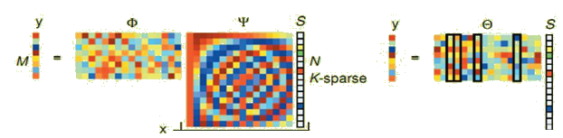

# Compressive Sensing

A common goal of the engineering field of signal processing is to reconstruct a signal from a series of sampling measurements. In general, this task is impossible because there is no way to reconstruct a signal during the times that the signal is not measured. Nevertheless, with prior knowledge or assumptions about the signal, it turns out to be possible to perfectly reconstruct a signal from a series of measurements. Over time, engineers have improved their understanding of which assumptions are practical and how they can be generalized.

An early breakthrough in signal processing was the Nyquist–Shannon sampling theorem. It states that if the signal's highest frequency is less than half of the sampling rate, then the signal can be reconstructed perfectly. The main idea is that with prior knowledge about constraints on the signal’s frequencies, fewer samples are needed to reconstruct the signal.

Around 2004, Emmanuel Candès, Terence Tao, and David Donoho proved that given knowledge about a signal’s sparsity, the signal may be reconstructed with even fewer samples than the sampling theorem requires. This idea is the basis of compressed sensing.

* Key components of Compressive Sensing
	- Sparse representation of a signal
	- The sensing matrix need to be designed to ensure that it preserves the information in the original signal x while reducing the dimension
	- Reconstruction method need to be designed.

* Mathematical representation
$$
y = \Phi x =\Phi \Psi s = \Theta s
$$

- Original data \(x\in \mathbb{R}^N\), sampling data \(y\in \mathbb{R}^M\), \(\Phi\) is measurement matrix \(M\times N\). The compressive sensing problem is that given y and \(\Phi\), solving x.

- A general signal is not sparse, and can be representaed by sparse linear combination of basis: \(x=\Psi s\). \(\Psi\) is a orthogonal basis matrix. s is a K-sparse signal, where \(K<M<<N\)

- \(\Theta = \Phi \Psi\) is called sensing matrix,

* Process
- Find a orthogonal basis \(\Psi\), to make x can be represented by a K-sparse signal s.
- Fnd a measurement matrix \(\Phi\), to make sensing matrix \(\Theta\) sastisfy Restricted Isometry Property(RIP), which ensure a unique map from s.
- Get y from \(\Phi\) and x.
- Recover x and y.

* Recovery Algorithm
- Greedy Algorithm, including matching pursuit, orthogonal matching pursuit, complementary matching pursuit.
- Convex Optimization Algorithms, which transform \(l_0\) norm to \(l_1\) norm problem, including gradient projection method, basis pursuit, and least angle regression.

