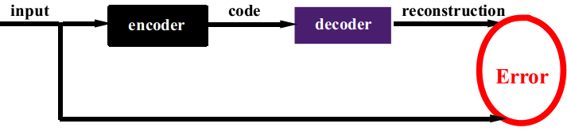

# Auto-encoder
Instead of being trainted to predict the target value Y given input x, autoencoders are trained to reconstruct their own inputs.

Thus the output has the same nnumber of nodes as the input layers.

* Simpler representation
	- lower dimensional representation
	- sparse representation
	- independent representation
* Methods
	- Reconstruct the input from the code and make code compact (Auto-encoder with Bottleneck).
	- Reconstruct the input from the code and make code sparse (Sparse Auto-encoders). Work in LeCun, Ng, Fergus, Lee, Yu’s labs.
	- Input is partially corrupted(Denoising Auto-encoders). Work in Y. Bengio, Lee's lab
	- Make sure that the model defines a distribution that normalizes to 1 (Restricted Boltzmann Machine). Work in Y. Bengio, Hinton, Lee, Salakthudinov's lab.
