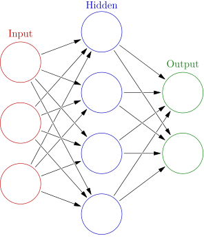

# Neural Network

An artificial neutral network (ANN) is a system that is based on the biological neural network.

An ANN is comprised of a network of artificial neurons (also known as "nodes"). These nodes are connected to each other, and the strength of their connections to one another is assigned a value based on their strength: inhibition or excitation. If the value of the connection is high, then it indicates that there is a strong connection.
Within each node's design, a transfer function is built in.

There are three types of neurons in an ANN, input nodes, hidden nodes, and output nodes.

The input nodes take in information, in the form which can be numerically expressed. The information is presented as activation values, where each node is given a number.

This information is then passed throughout the network. Based on the connection strengths (weights), inhibition or excitation, and transfer functions, the activation value is passed from node to node. Each of the nodes sums the activation values it receives; it then modifies the value based on its transfer function.

The activation flows through the network, through hidden layers, until it reaches the output nodes. The output nodes then reflect the input in a meaningful way to the outside world.

The difference between predicted value and actual value (error) will be propagated backward by apportioning them to each node's weights according to the amount of this error the node is responsible for (e.g., gradient descent algorithm).

There are different types of neural networks, but they are generally classified into feed-forward and feed-back networks.

## A feed-forward network 
- A non-recurrent network which contains inputs, outputs, and hidden layers; the signals can only travel in one direction.

- Input data is passed onto a layer of processing elements where it performs calculations. Each processing element makes its computation based upon a weighted sum of its inputs. The new calculated values then become the new input values that feed the next layer. This process continues until it has gone through all the layers and determines the output.

- A threshold transfer function is sometimes used to quantify the output of a neuron in the output layer.

- Feed-forward networks include Perceptron (linear and non-linear) and Radial Basis Function networks.

- Feed-forward networks are often used in data mining.

- Common Examples are Perceptrons, Back Propagation Network, and Radial Basis Function Network.

## A feed-back network
- they can have signals traveling in both directions using loops.

- All possible connections between neurons are allowed.

- Since loops are present in this type of network, it becomes a non-linear dynamic system which changes continuously until it reaches a state of equilibrium.

- Feed-back networks are often used in associative memories and optimization problems where the network looks for the best arrangement of interconnected factors.

- Common Examples are Boltzmann machine and Hopfield network.
