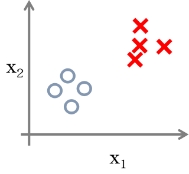
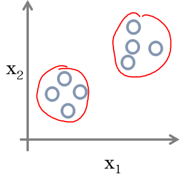
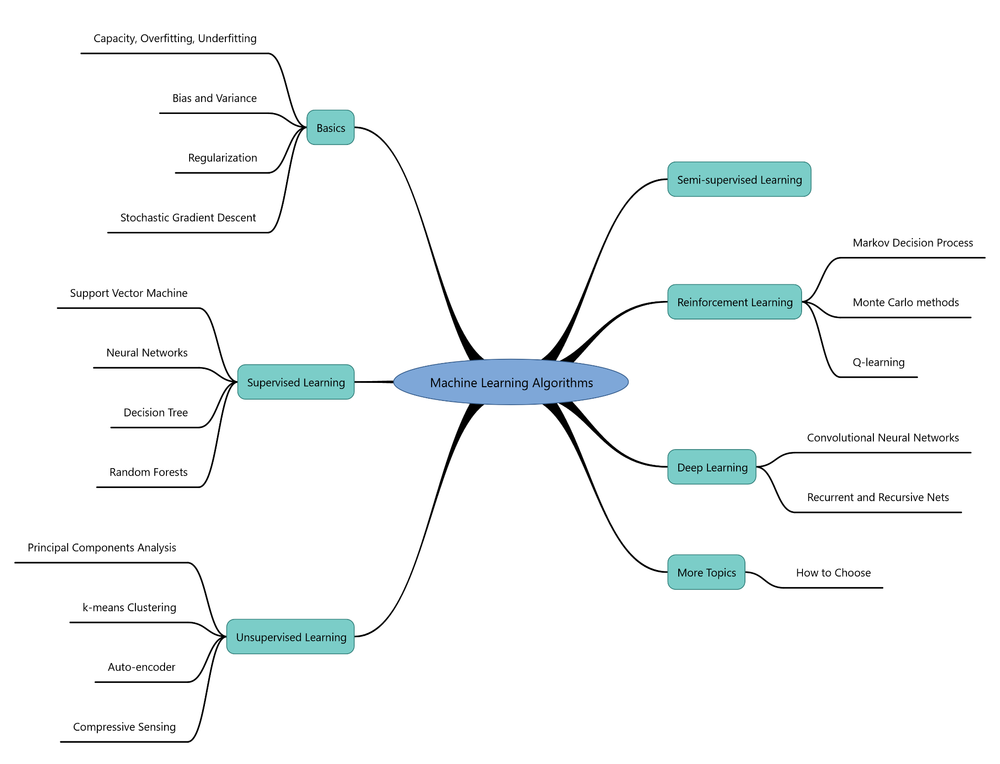

## Supervised Learning
Supervised learning is the machine learning task of inferring a function from labeled training data. The training data consist of a set of training examples. In supervised learning, each example is a pair consisting of an input object (typically a vector) and a desired output value (also called the supervisory signal).

## Unsupervised Learning
Unsupervised learning is a type of machine learning algorithm used to draw inferences from datasets consisting of input data without labeled responses. The most common unsupervised learning method is cluster analysis, which is used for exploratory data analysis to find hidden patterns or grouping in data.

## Semi-supervised Learning
Semi-supervised learning is a class of supervised learning tasks and techniques that also make use of unlabeled data for training – typically a small amount of labeled data with a large amount of unlabeled data.

## Reinforcement Learning
In reinforcement learning, the algorithm gets 
to choose an action in response to each data point. 
The learning algorithm also receives a reward 
signal a short time later, indicating how good the 
decision was. Based on this, the algorithm modifies 
its strategy in order to achieve the highest reward. 
Reinforcement learning is common in robotics, where the set of sensor readings at one point in time is a data point, and the algorithm must choose the robot's next action. It is also a natural fit for Internet of Things applications.

## Deep Learning
Deep learning (also known as deep structured learning, hierarchical learning or deep machine learning) is a branch of machine learning based on a set of algorithms that attempt to model high-level abstractions in data by using multiple processing layers, with complex structures or otherwise, composed of multiple non-linear transformations.

## Algorithm Map

