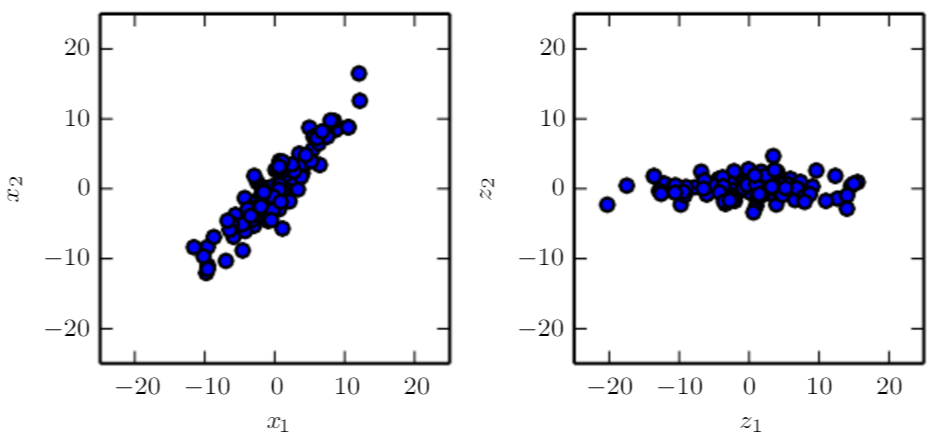

# Principal Components Analysis

PCA learns a representation that has lower dimensionality than the original input. It also learns a representation whose elements have no linear correlation with each other. It learns a linear projection that aligns the direction of the greatest variance with the axes of the new space.

The original data consists of samples of **x**. In this space, the variance might occur along the directions that are not axis-aligned.

The transformed data \(\textbf{z}=\textbf{x}^T\textbf{W}\\) now varies most along the axis of \(\textbf{z}_1\). 