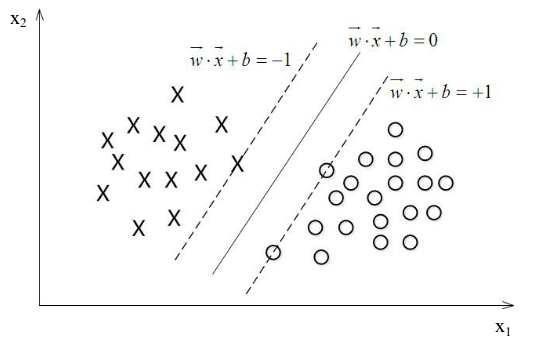
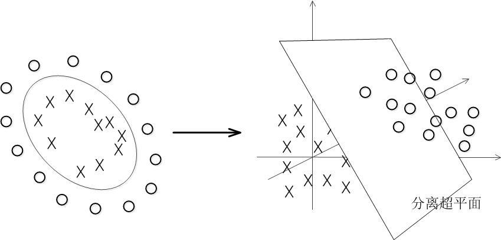

# Support Vector Machine

If the training data are linearly separable, we can select two hyperplanes in a way such that it separates the data and the distance between the data are maximized. The regeion bound by them is called "the margin".

The plane can be describe as 
$$
\textbf{w}^T \textbf{x} + b = 0
$$

As *w* and b could by scaled by any rate, we can normalize the two hyperplanes as 
$$
\textbf{w}^T \textbf{x} + b = 1 \\
\textbf{w}^T \textbf{x} + b = -1
$$

And we can get the constraint
$$
y^{(i)}(\textbf{w}^T \textbf{x}^{(i)} + b) \geq 1
$$
for each i = 1,2,...m.

Geometrically, the distance between these two hyperplanes is \( \frac{2}{||\textbf{w}||^2}\), so we need to minimize \(\frac{1}{2}||\textbf{w}||^2 \).

Then the question turns into: 
$$
min \frac{1}{2}||\textbf{w}||^2 \\
s.t. y^{(i)}(\textbf{w}^T \textbf{x}^{(i)} + b) \geq 1, i = 1,2,...,m
$$

### Kernel
In real case, we need to separate data that are not linearly separable. The basic idea is to map the data into higher dimensional space . The classifier is a hyperplane in the high-dimensional space.

Given training data, \((\textbf{x}^{(1)}, y^{(1)}), (\textbf{x}^{(2)}, y^{(2)}) ... (\textbf{x}^{(m)}, y^{(m)})\), for each \(\textbf{x}^{(i)}\), we calculate the m-dimensional \(\textbf{f}^{(i)}\):
$$
\textbf{f}^{(i)}_1 = K(\textbf{x}^{(i)}, \textbf{x}^{(1)}),\textbf{f}^{(i)}_2 = K(\textbf{x}^{(i)}, \textbf{x}^{(2)}),..., \textbf{f}^{(i)}_m = K(\textbf{x}^{(i)}, \textbf{x}^{(m)})
$$

The original question turns into:
$$
min \frac{1}{2}||\textbf{a}||^2 \\
s.t. y^{(i)}(\textbf{a}^T \textbf{f}^{(i)} + b) \geq 1, i = 1,2,...,m
$$

**Common Kernels**

+ Linear: \(K(\textbf{x}^{(i)}, \textbf{x}^{(j)})=\textbf{x}^{(i)^{\textbf{T}}}\textbf{x}^{(j)}\)

+ Polynomial: \(K(\textbf{x}^{(i)}, \textbf{x}^{(j)})=(\gamma\textbf{x}^{(i)^{\textbf{T}}}\textbf{x}^{(j)}+r)^d, \gamma > 0 \)

+ Radial Basis FUction (RBF): \(K(\textbf{x}^{(i)}, \textbf{x}^{(j)})=exp(-\gamma||\textbf{x}^{(i)}-\textbf{x}^{(j)}||^2), \gamma > 0 \)

+ Sigmoid: \(K(\textbf{x}^{(i)}, \textbf{x}^{(j)})=tanh(\gamma\textbf{x}^{(i)^{\textbf{T}}}\textbf{x}^{(j)}+r)\)

