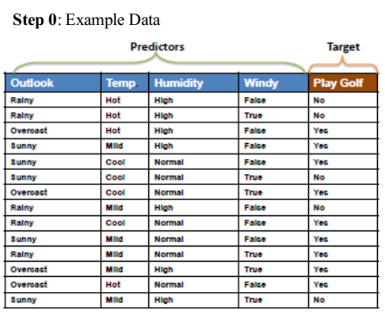
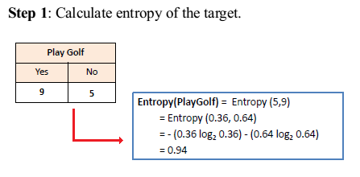
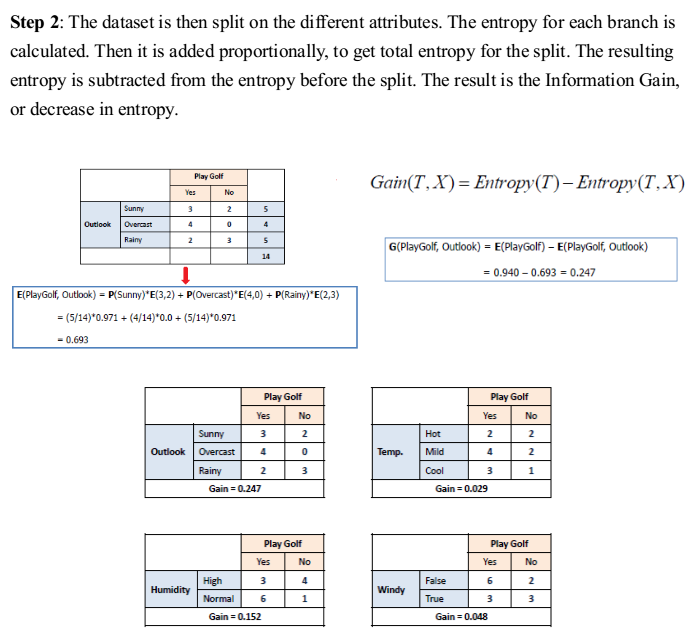
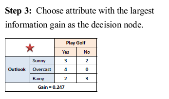
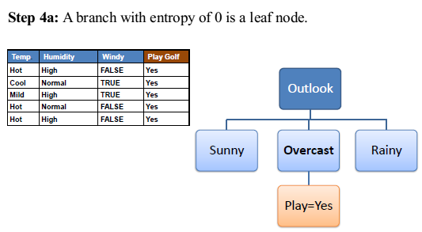
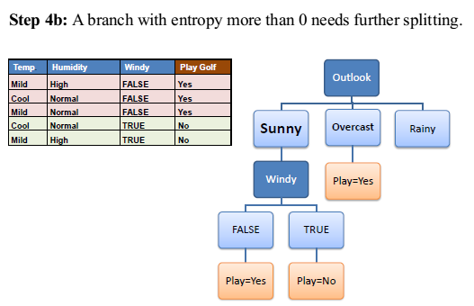
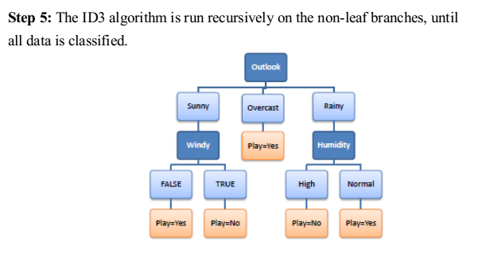
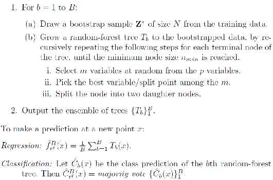

# Decision Tree

Decision tree builds classification or regression models in the form of a tree structure. It breaks down a dataset into smaller and smaller subsets while at the same time an associated decision tree is incrementally developed. The final result is a tree with decision nodes and leaf nodes. 

Decision tree learning is the construction of a decision tree from class-labeled training tuples. A decision tree is a flow-chart-like structure, where each internal (non-leaf) node denotes a test on an attribute, each branch represents the outcome of a test, and each leaf (or terminal) node holds a class label. The topmost node in a tree is the root node.

There are many specific decision-tree algorithms. Notable ones include:

- ID3 (Iterative Dichotomiser 3)
- C4.5 (successor of ID3)
- CART (Classification And Regression Tree)
- CHAID (CHi-squared Automatic Interaction Detector). Performs multi-level splits when computing classification trees.
- MARS: extends decision trees to handle numerical data better.
- Conditional Inference Trees. Statistics-based approach that uses non-parametric tests as splitting criteria, corrected for multiple testing to avoid overfitting. This approach results in unbiased predictor selection and does not require pruning.

# Random Forest

