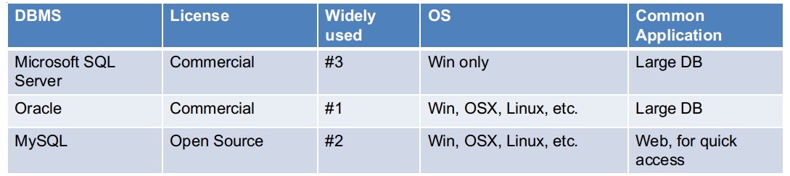

# Relational Database

## Overview
* Database model is the logical structure of database:
	- Relational model 
	- graph model
	- object-oriented database model 

* Relational Model:
	- Data are stored in flat tables, each row representing an entity or a relationship, and each column representing an attribute of entities 
	- Each table row must have a unique identifying set of row values (i.e. a key) 
	- Any value occurring in two different records (belonging to the same table or to different tables), implies a relationship among those two records

* Comparison


## MySQL

* Feature
	- 256TB support by default, can be extended
	- Support for up to 64 indexes per table. Each index may consist of 1 to 16 columns or parts of columns.
	- Mature interface

* MySQL installation
	- Windows

		* Download MySQL Installer from [this link](http://dev.mysql.com/downloads/installer/) and execute it

	- OS X

		* [See this page](https://dev.mysql.com/doc/refman/5.6/en/osx-installation-pkg.html)

	- Ubuntu
```bash
	sudo apt-get update 
	sudo apt-get install mysql-server 
	sudo mysql_secure_installation 
	sudo mysql_install_db
```
	

* MySQLdb
	- It is Python API to access MySQL database system. [Download.](http://www.runoob.com/python/python-mysql.html)
	- Usage:
		+ All SQL are executed via cursor.execute()
		+ The SQL result are stored in generator like object.
* Database vs Flat Files
	- no need to parse the input
	- faster for repeated usage of the same dataset
	- can be updated easily
	- easy to query, select and process the data
	- can handle multiprocess/multithreaded access
	- can handle transactions and concurrent access 
## Reference
	- Relational Model: lecture slides of the course Database of DTU Compute, offered by Flemming Schmidt.
	- [DBMS comparison](https://en.wikipedia.org/wiki/Comparison_of_relational_database_management_systems)
